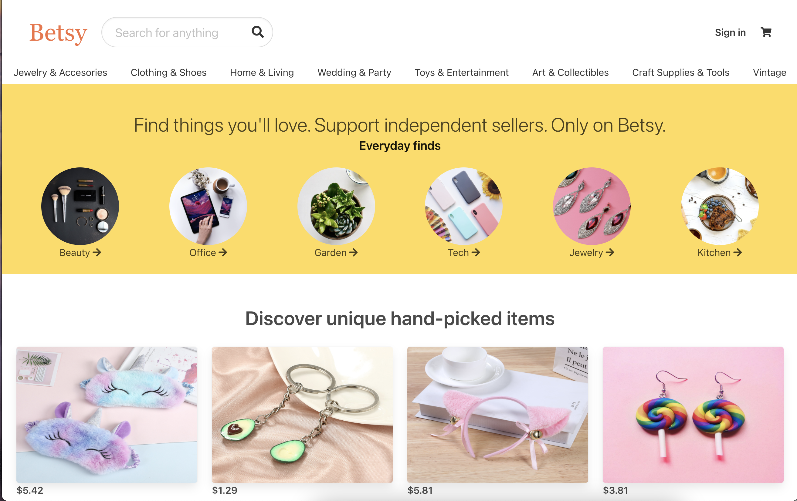

# Betsy Marketplace
---

## Description 
A multi-vendor marketplace modeled after Etsy 

## Languages, Libraries & Frameworks
* Python
* Flask 
* CSS
* Bulma
* HTML
* SQLite
* Peewee

## Setup 
1. Clone the repository and with Python3 create a virtual environment in the directory.
2. Activate the environment `source <your_env_name>/bin/activate`
3. Install the necessary dependencies `pip install -r requirements.txt`
4. Run `python main.py`. 

You should now see a 'betsy.db' file appear in the current directory. You can now view the application on http://127.0.0.1:5000/

## Screenshots

## Video Demo 
https://youtu.be/gcu0Do8sEho

<iframe width="560" height="315" src="https://www.youtube.com/embed/gcu0Do8sEho" frameborder="0" allow="accelerometer; autoplay; clipboard-write; encrypted-media; gyroscope; picture-in-picture" allowfullscreen></iframe>

## Usage & Details 
A nearly identical copy of Etsy. This multivendor marketplace was built as practice for modelling and querying a database, as well as grasping how an ecommerce store may function on the backend. 

* Users are able to search for products based on a term. This search is case-insensitive
* As a user/site-visitor i'm able to view the products of a given user
* As a user/site-visitor i'm able to view all products for a given tag
* As a user i'm able to add a product to my store
* As a user i'm able to edit or remove a product from my store
* As a user i'm able to add, modify and remove products in my cart
* As a user I receive a personal greeting whenever i log in

## Credits
Credit goes to [SteinOveHelset](https://github.com/SteinOveHelset), his tutorial "How to make a multi-vendor ecommerce store using Django" was of invaluable help for making Betsy.